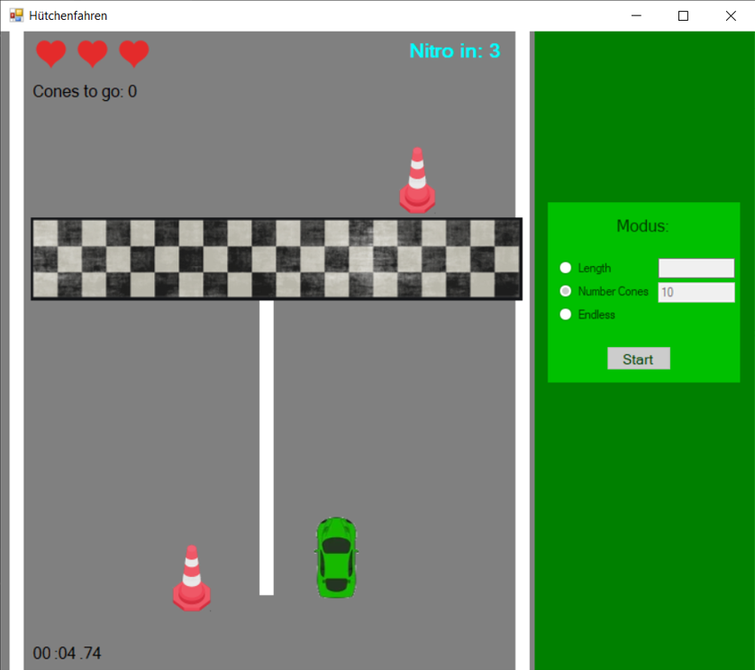
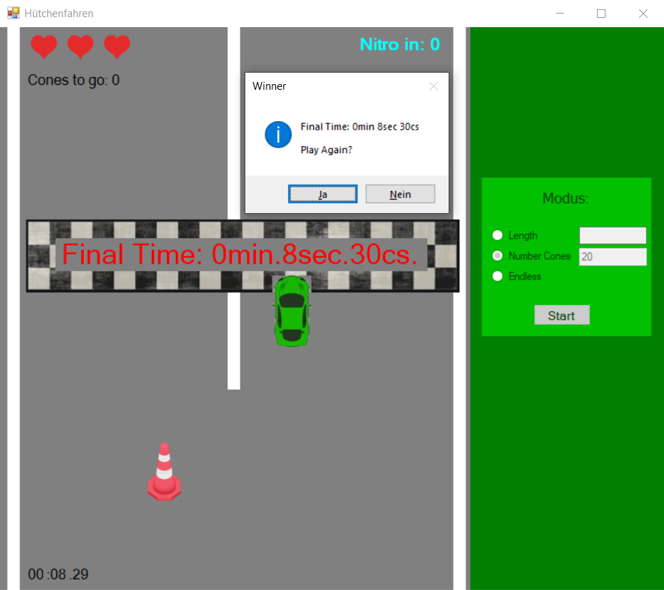
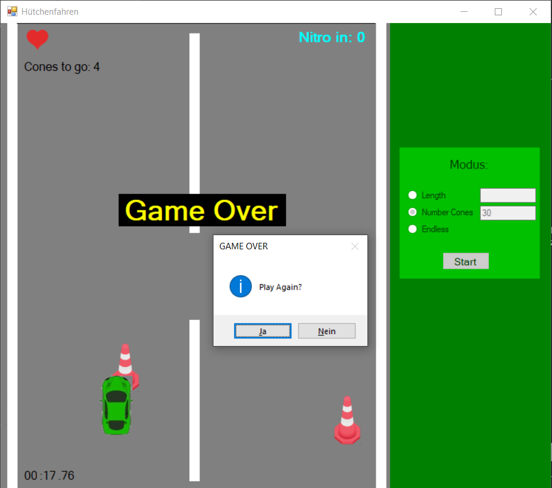

# 2D Car Game in C#

## Description

Welcome to the 2D Car Game in C#! This game was developed as a project to practice the fundamentals of C#. It can be highly improved, and your feedback is welcome!

The goal of the game is to pass the finish line with your car in the shortest time possible while avoiding obstacles (cones) coming from the top. You have three lives, and each time you collide with a cone, you lose one life. When you run out of lives, it's game over.

This game offers three different modes:

1. **Length Mode**: You can type in the length of the street, and the game will generate a street of that length with cones.

2. **Cone Mode**: Type in the number of cones that will descend from the top. The challenge is to navigate through a set number of cones to reach the finish line.

3. **Endless Mode**: Drive endlessly until you run out of lives. Cones keep coming down, and your goal is to survive as long as possible.

## Gameplay

- Control your car using the following keys:
  - **Right**: `.`
  - **Left**: `,`
  - **Accelerate**: `A`
  - **Nitro Boost**: `S` (Available every 5 seconds)
- Use acceleration strategically to move faster but be ready to slow down to avoid cones.
- Nitro boost helps you move up the screen quickly, potentially allowing you to pass the finish line faster. However, it also increases the difficulty as you'll need faster reactions to dodge the cones.

- When you successfully pass the finish line, your total time is displayed, and you have the option to play again.

## Screenshots

